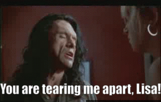

# subsync

Language-agnostic automatic synchronization of subtitles with video,
so that subtitles are aligned to the correct starting point within the video.

The implementation for this project was started during HackIllinois 2019,
for which it received an **_Honorable Mention_**
(ranked in the top 5 projects, excluding projects that won company-specific prizes).

Turn this:                       |  Into this:
:-------------------------------:|:-------------------------:
  |  

# Install
First, make sure ffmpeg is installed. On MacOS, this looks like:
~~~
brew install ffmpeg
~~~
Next, grab the script. It should work with both Python 2 and Python 3:
~~~
pip install git+https://github.com/smacke/subsync
~~~

# Usage
~~~
subsync video.mp4 -i unsynchronized.srt > synchronized.srt
~~~

or

~~~
subsync video.mp4 -i unsynchronized.srt -o synchronized.srt
~~~

Although it can usually work if all you have is the video file, there may be occasions where you have a correctly synchronized "reference" srt file in a language you are unfamiliar with, as well as an unsynchronized srt file in your native language.  In this case, it will be faster to do the following:

~~~
subsync reference.srt -i unsynchronized.srt -o synchronized.srt
~~~

Whether to perform voice activity detection on the audio or to directly extract speech from an srt file is determined from the file extension.

# VLC Integration
To demonstrate how one might use `subsync` seamlessly with real video software,
we developed a prototype integration into the popular [VLC](https://www.videolan.org/vlc/index.html)
media player, which was demoed during the HackIllinois 2019 project expo. The resulting patch
can be found in the file [subsync-vlc.patch](https://github.com/smacke/subsync/raw/master/subsync-vlc.patch).
Here are instructions for how to use it.

1. First clone the 3.0 maintenance branch of VLC and checkout 3.0.6:
~~~
git clone git://git.videolan.org/vlc/vlc-3.0.git
cd vlc-3.0
git checkout 3.0.6
~~~
2. Next, apply the patch:
~~~
wget https://github.com/smacke/subsync/raw/master/subsync-vlc.patch
git apply subsync-vlc.patch
~~~
3. Follow the normal instructions on the
[VideoLAN wiki](https://wiki.videolan.org/VLC_Developers_Corner/)
for building VLC from source. *Warning: this is not easy.*

You should now be able to autosynchronize subtitles using the hotkey `Ctrl+Shift+S`
(only enabled while subtitles are present).

# Speed
My experience is that `subsync` usually finishes running in 20 to 30 seconds,
depending on the length of the video. The most expensive step is actually
extraction of raw audio. If you already have a correctly synchronized "reference" srt
file (in which case the video is no longer necessary),
`subsync` typically runs in less than a second.

# How It Works
The synchronization algorithm operates in 3 steps:
1. Discretize video and subtitles by time into 10ms windows.
2. For each 10ms window, determine whether that window contains speech.
   This is trivial to do for subtitles (we just determine whether any subtitle is "on" during each time window);
   for video, use an off-the-shelf voice activity detector (VAD) like
   the one built into [webrtc](https://webrtc.org/).
3. Now we have two binary strings: one for the subtitles, and one for the video.
   Try to align these strings by matching 0's with 0's and 1's with 1's. We score
   these alignments as (# video 1's matched w/ subtitle 1's) - (# video 1's matched with subtitle 0's).

The best-scoring alignment from step 3 determines how to offset the subtitles in time
so that they are properly synced with the video. Because the binary strings
are fairly long (millions of digits for video longer than an hour), the naive
O(n^2) strategy for scoring all alignments is unacceptable. Instead, we use the
fact that "scoring all alignments" is a convolution operation and can be implemented
with the Fast Fourier Transform (FFT), bringing the complexity down to O(n log n).

# Does It Work?
I have yet to find a case where the automatic synchronization has been off by
more than ~1 second. If the reference is another subtitle file, I think it should
work every time. I would expect that it could fail sometimes when the reference is
a video since speech extraction is a noisier process, but I have not found any
bad cases yet (currently tested on ~10 videos more than 30 minutes in length).

# Future Work
The prototype VLC patch is very experimental -- it was developed under pressure
and just barely works. I would love to see this project more robustly
integrated with VLC, either directly in the VLC core, or as a plugin.
If you or anyone you know has ideas for how to accomplish this, please let me know!

Also: although I have not found cases where the synchronization algorithm fails, this does
not mean they don't exist. It would be good to find these cases so as to better understand
the algorithm's pain points.

# Credits
This project would not be possible without the following libraries:
- [ffmpeg](https://www.ffmpeg.org/) and the [ffmpeg-python](https://github.com/kkroening/ffmpeg-python) wrapper, for extracting raw audio from video
- VAD from [webrtc](https://webrtc.org/) and the [py-webrtcvad](https://github.com/wiseman/py-webrtcvad) wrapper, for speech detection
- [srt](https://pypi.org/project/srt/) for operating on [SRT files](https://en.wikipedia.org/wiki/SubRip#SubRip_text_file_format)
- [numpy](http://www.numpy.org/) and, indirectly, [FFTPACK](https://www.netlib.org/fftpack/), which powers the FFT-based algorithm for fast scoring of alignments between subtitles (or subtitles and video).
- Other excellent Python libraries like [argparse](https://docs.python.org/3/library/argparse.html) and [tqdm](https://tqdm.github.io/), not related to the core functionality, but which enable much better experiences for developers and users.

# License
Code in this project is [MIT licensed](https://opensource.org/licenses/MIT).
